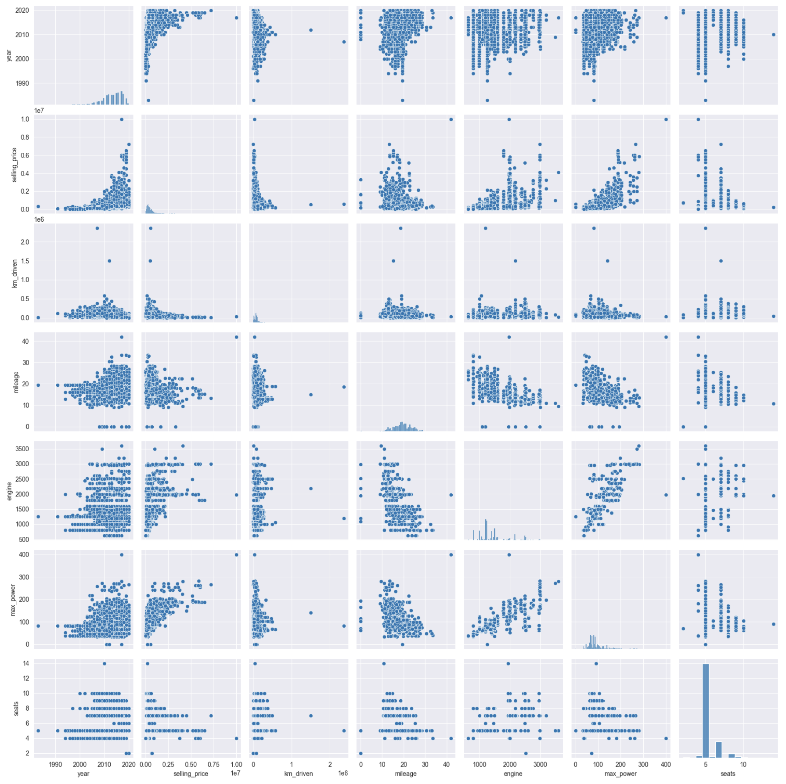
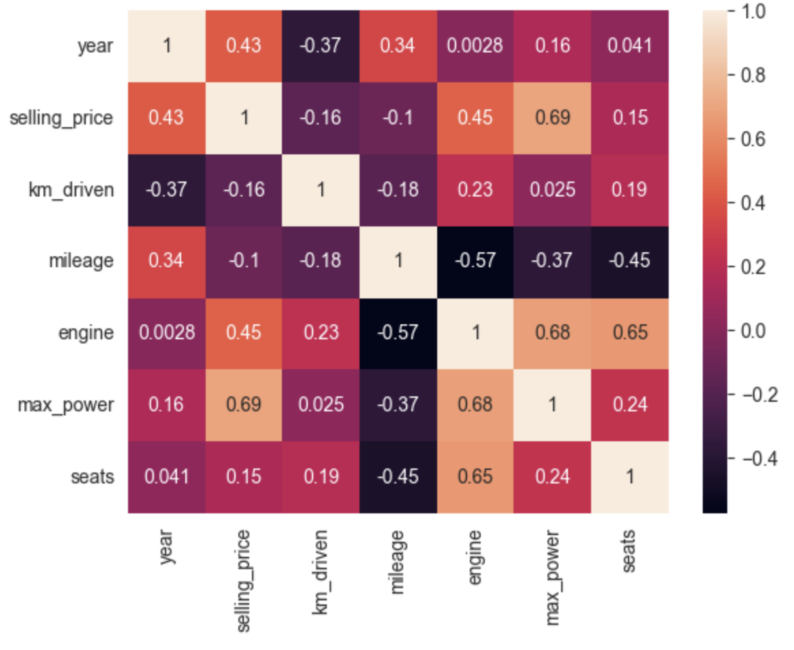
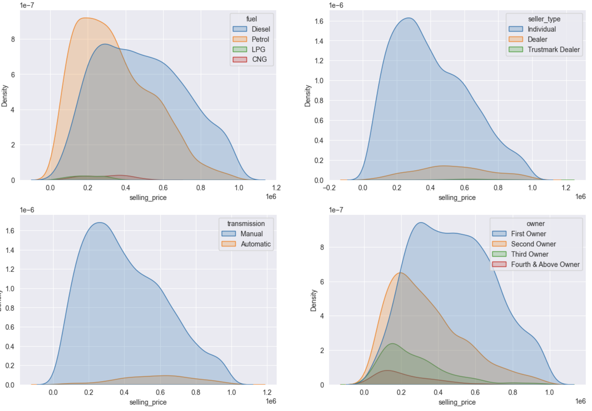
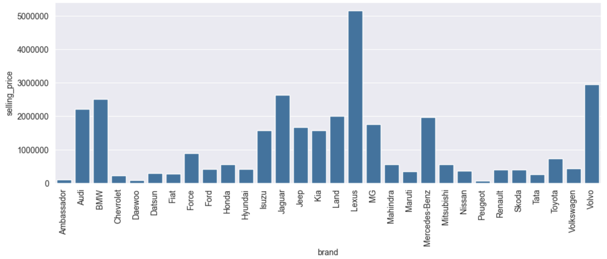

# Анализ данных
В ходе анализа данных было выполнено следующее:
- проведен обзорный анализ тренировочного и тестового датасетов (далее - трейн и тест, соответственно); 
- выявлено наличие пропусков в значениях признаков mileage, engine, max_power, torque и seats в трейне и тесте, 
которые были заполнены медианами трейна (за исключением признака torque, который был удален в связи со сложностью 
его разбора);
- удалены дубликаты в трейне (1159 объектов с дублирующим признаковым описанием);
- признаки mileage, engine, max_power были преобразованы в численные путем удаления из них наименование 
единиц измерения;
- было определено, что признак seats, несмотря числовой тип, скорее является категориальным, так как имеет 
ограниченный дискретный набор значений и не имеет линейной зависимости с целевой переменной. 

В результате анализа попарных диаграмм рассеяния численных признаков были отмечены следующие закономерности: 
- чем выше значение года выпуска автомобиля (year), тем в среднем выше его цена. При этом, среди автомобилей любого 
года выпуска есть как дешевые модели, так и дорогие. И цена их в рамках одного и того же года тоже может быть меньше или 
больше;
- чем больше пробег (km_driven), тем меньше в среднем его цена. Но аналогично году выпуска, для каждого значения
пробега можно найти как дорогие марки машин, так и дешевые, поэтому минимум цены почти не меняется в зависимости 
от пробега, а максимум - снижается;
- значения mileage (расстояние, которое автомобиль может проехать на одном литре/килограмме топлива) влияет на 
цену довольно слабо. В диапазоне значений mileage от 10 до 30, где сосредоточено большинство автомобилей выборки, 
можно заметить небольшое снижение средней цены, что может быть связано с тем, что экономные автомобили (имеющие 
большее значение mileage) обычно более дешевые, т.к. экономичность должна проявляться и в стоимости самого автомобиля;
- чем больше значения объема двигателя (engine) и его мощности (max_power), тем в среднем выше цена;
- количество мест в автомобиле (seats) влияет на цену, но влияет нелинейно. Так для наиболее популярных значений 
seats (5 и 7 мест) диапазон цены достаточно широкий, в то время, как для значения 6 максимальное и средние значения
цены существенно ниже.

Также было отмечено, что: 
- видна заметная положительная корреляция между объемом и мощностью двигателя;
- можно заметить небольшую отрицательную корреляцию между мощностью двигателя (и, соответственно, его объемом) 
и mileage, что тоже объяснимо, т.к. мощные двигатели бывают менее экономичными.

Значения коэффициентов корреляции численных признаков в целом согласуются с выдвинутыми предположениями: наибольшее 
влияние на целевую переменную оказывают признаки max_power (коэффициент корреляции 0.69),
engine (коэффициент корреляции - 0.45) и year (коэффициент корреляции - 0.43).

    </img> 

Также по построенным графикам распределения цены автомобиля в зависимости от значений некоторых 
категориальных признаков было отмечено, что распределения несколько отличаются, т.е. имеет место зависимость
целевой переменной от данных категориальных признаков

Кроме того, по графику зависимости медианы цены от марки автомобиля был сделан вывод, что марка автомобиля 
влияет на цену.

