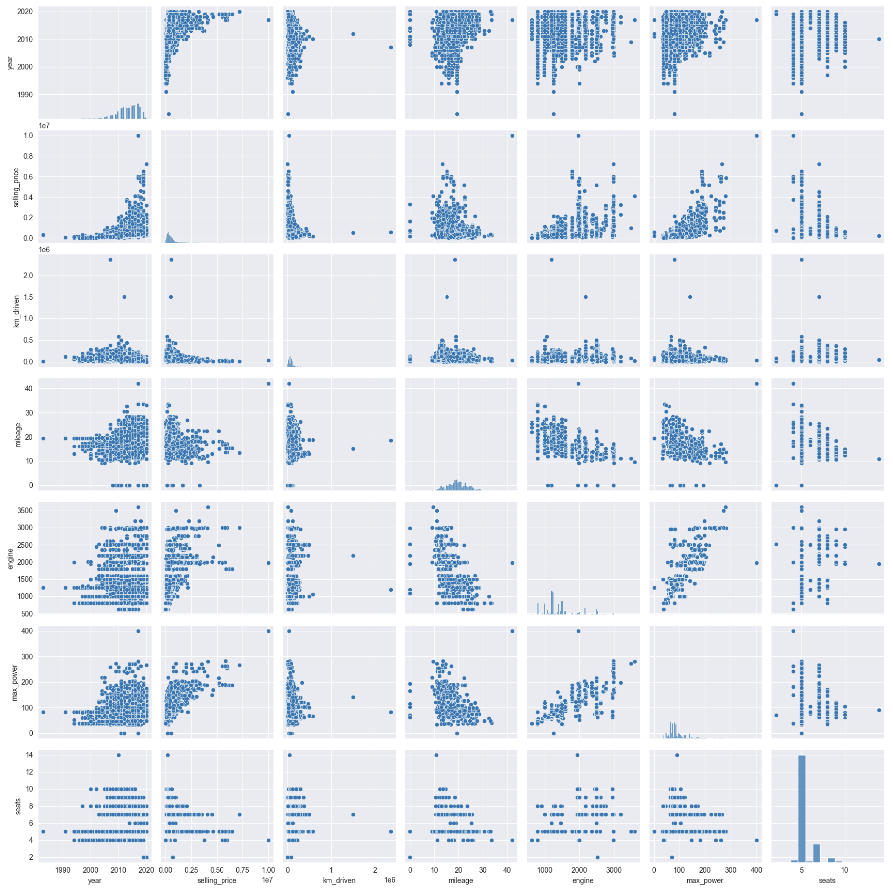

# Сервис предсказания стоимости автомобиля (д/з №1 по Машинному обучению, МОВС2023)  
Сервис предсказания стоимости автомобилей по их признаковому описанию разработан в рамках 
домашнего задания №1 по предмету "Машинное обучение" в магистратуре МОВС2023. В ходе разработки 
был проведен разведочный анализ данных и предварительная подготовка тренировочного и тестового датасетов, 
конструирование новых и преобразование существующих признаков, обучение и оценка моделей линейной регрессии, 
а также создание на базе лучшей модели данного сервиса предсказания стоимости автомобилей. 

Видео-демонстрация работы с сервисом [размещена на YouTube](https://www.youtube.com/watch?v=gY5yGY9AT9c)

Краткое описание результатов выполненной работы приведено ниже. Подробное описание работы приведено 
в данном [Jupyter Notebook](https://github.com/SeVlVershinin/ml-hw01/blob/main/HW1_Regression_with_inference.ipynb)

- [Анализ данных](#анализ-данных)
- [Обучение модели](#обучение-моделей)
- [Feature engineering](#feature-engineering)
- [Сервис на FastApi](#сервис-на-fastapi)
- [Запуск сервиса](#запуск-сервиса)

## Анализ данных
В ходе анализа данных было:
- проведен обзорный анализ тренировочного и тестового датасетов (далее - трейн и тест, соответственно); 
- выявлено наличие пропусков в значениях признаков mileage, engine, max_power, torque и seats в трейне и тесте, 
которые были заполнены медианами трейна (за исключением признака torque, который был удален в связи со сложностью 
его разбора);
- удалены дубликаты в трейне (1159 объектов с дублирующим признаковым описанием);
- признаки mileage, engine, max_power были преобразованы в численные путем удаления из них наименование 
единиц измерения;
- было определено, что признак seats, несмотря числовой тип, скорее является категориальным, так как имеет 
ограниченный дискретный набор значений и не имеет линейной зависимости с целевой переменной. 

В результате анализа попарных диаграмм рассеяния численных признаков были отмечены следующие закономерности: 
- чем выше значение года выпуска автомобиля (year), тем в среднем выше его цена. При этом, среди автомобилей любого 
года выпуска есть как дешевые модели, так и дорогие. И цена их в рамках одного и того же года тоже может быть меньше или 
больше;
- чем больше пробег (km_driven), тем меньше в среднем его цена. Но аналогично году выпуска, для каждого значения
пробега можно найти как дорогие марки машин, так и дешевые, поэтому минимум цены почти не меняется в зависимости 
от пробега, а максимум - снижается;
- значения mileage (расстояние, которое автомобиль может проехать на одном литре/килограмме топлива) влияет на 
цену довольно слабо. В диапазоне значений mileage от 10 до 30, где сосредоточено большинство автомобилей выборки, 
можно заметить небольшое снижение средней цены, что может быть связано с тем, что экономные автомобили (имеющие 
большее значение mileage) обычно более дешевые, т.к. экономичность должна проявляться и в стоимости самого автомобиля;
- чем больше значения объема двигателя (engine) и его мощности (max_power), тем в среднем выше цена;
- количество мест в автомобиле (seats) влияет на цену, но влияет нелинейно. Так для наиболее популярных значений 
seats (5 и 7 мест) диапазон цены достаточно широкий, в то время, как для значения 6 максимальное и средние значения
цены существенно ниже.

Также было отмечено, что: 
- видна заметная положительная корреляция между объемом и мощностью двигателя;
- можно заметить небольшую отрицательную корреляцию между мощностью двигателя (и, соответственно, его объемом) 
и mileage, что тоже объяснимо, т.к. мощные двигатели бывают менее экономичными.


## Обучение моделей
To be done
## Feature engineering
To be done
## Сервис на FastApi
To be done

## Запуск сервиса
Для запуска сервиса на локальной машине: 
- склонируйте данный репозиторий
```commandline
git clone https://github.com/SeVlVershinin/ml-hw01.git
```
- установите необходимые библиотеки Python с помощью pip install
```commandline
pip install -r requirements.txt
```
- запустите сервис, запустив его с помощью uvicorn
```commandline
uvicorn main:app --host "0.0.0.0" --port 80
```
После этого вы можете открыть страницу с описанием методов сервиса по ссылке ```http://localhost/docs``` 

Для работы сервиса необходима версия Python 3.11
